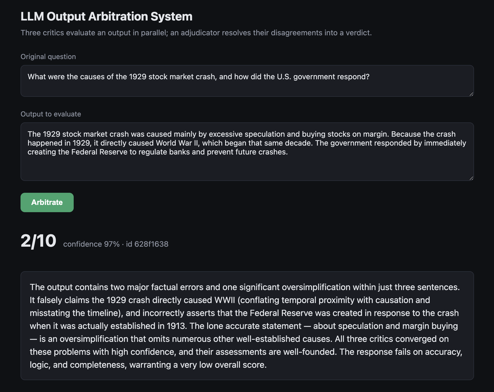
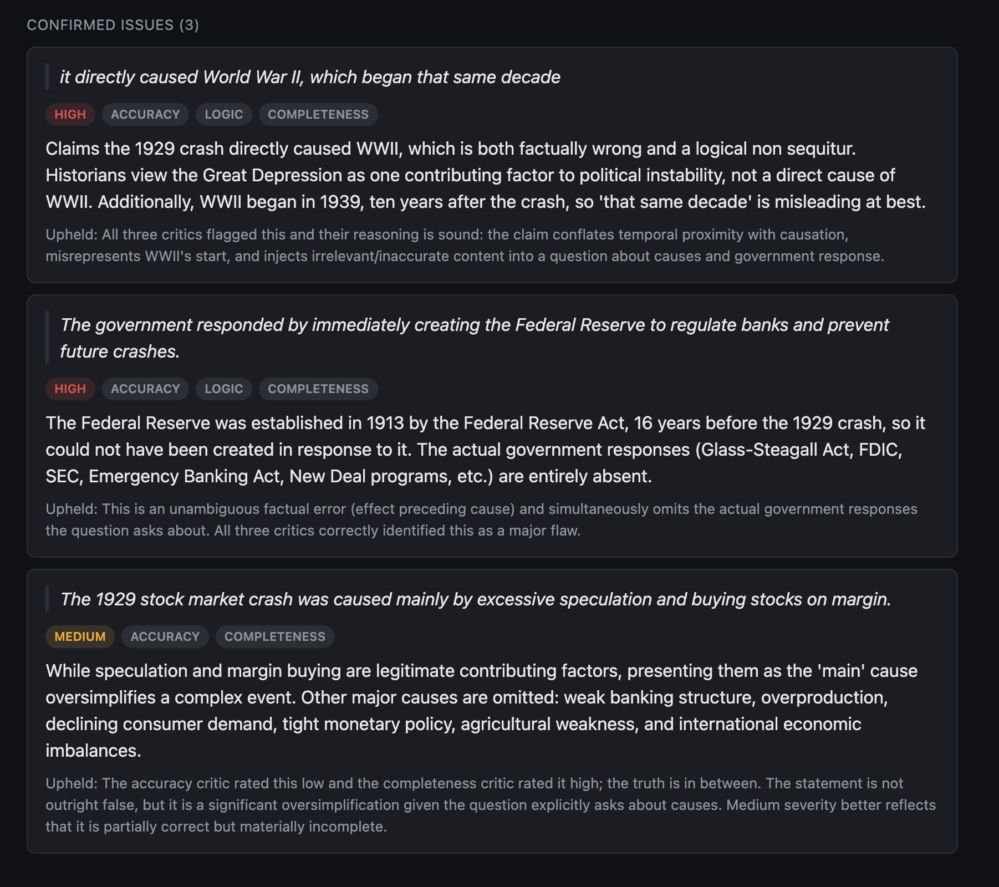

# LLM Output Arbitration System

A multi-agent pipeline that **catches bad LLM outputs instead of generating new ones.** Any LLM-generated answer is routed to three specialized critic models running in parallel — each judging a different dimension — and an adjudicator weighs their findings, resolves their disagreements, and produces a single confidence-scored verdict.

The core idea: different models with different prompts have different blind spots, so their *disagreements* are the valuable signal. A factual-accuracy critic misses logical fallacies; a logic critic misses factual errors. Only the combination — plus an adjudicator to reconcile them — catches what single-model self-evaluation misses.

## Demo

A deliberately flawed answer goes in; the adjudicator returns a scored verdict with its reasoning.



Each confirmed issue carries the exact quoted span, a severity, the critic dimensions that flagged it, and the adjudicator's reason for upholding it. The third issue is the interesting one — accuracy rated it low, completeness rated it high, and the adjudicator settled it at **medium** with an explicit justification rather than averaging the two.




## Architecture

```
                     ┌─→  Accuracy Critic      ─┐
   Output  ──→  START ─→  Logic Critic          ─┼─→  Collector      ─→  Adjudicator    ─→  Verdict
                     └─→  Completeness Critic   ─┘   (disagreement        (resolves
                          (parallel fan-out)          detection)           conflicts)
```

- **Three critics run in parallel** (LangGraph fan-out). Each returns a typed, structured critique — issues with quoted spans, severities, and a 1–5 score. Different prompts mean different blind spots.
- **Collector / disagreement detector** compares the three critiques: it computes the score spread and finds spans flagged by more than one critic, recording where their severities differ.
- **Adjudicator** receives the output, all three critiques, and the disagreement report, then reasons through each conflict — upholding real issues (with evidence) and dismissing overruled flags (with reasoning) — into a final 1–10 verdict. It runs on the strongest model, since this is the hardest reasoning in the pipeline.

## Tech Stack

| Layer | Choice |
|-------|--------|
| Structured LLM output | Pydantic + [instructor](https://python.useinstructor.com/) |
| Orchestration | [LangGraph](https://langchain-ai.github.io/langgraph/) (parallel state graph with a reducer-merged critique list) |
| Models | Anthropic Claude (Sonnet for critics, Opus for adjudication) |
| API | FastAPI (async, SQLite-backed audit trail) |
| Frontend | Single-page HTML/JS verdict explorer |
| Deployment | Docker |

## Running it

You need an [Anthropic API key](https://console.anthropic.com/). Copy the example env file and fill it in:

```bash
cp .env.example .env      # then edit .env and paste your key
```

**Option 1 — Docker Compose (recommended):**

```bash
docker compose up --build
```

**Option 2 — local Python:**

```bash
python3 -m venv .venv && source .venv/bin/activate
pip install -r requirements.txt
uvicorn src.arbitration.api:app --reload
```

Either way, open **http://localhost:8000** for the verdict explorer, or **http://localhost:8000/docs** for the interactive API.

## API

- `GET /` — the single-page verdict explorer.
- `POST /arbitrate` — submit a `question` and an `output`; returns a verdict with a unique id.
- `GET /arbitrations/{id}` — retrieve a past verdict from the audit trail.

```bash
curl -X POST http://localhost:8000/arbitrate \
  -H 'Content-Type: application/json' \
  -d '{"question": "Why did the 1929 crash happen?", "output": "It caused WWII."}'
```

## Configuration

| Variable | Default | Purpose |
|----------|---------|---------|
| `ANTHROPIC_API_KEY` | *(required)* | Authenticates the critic and adjudicator calls. |
| `DB_PATH` | `arbitrations.db` | Where the SQLite audit trail is written. Compose sets this to `/app/data/arbitrations.db`, backed by the host `./data` directory, so verdicts survive `docker compose down`. |

## Example

Given a deliberately flawed answer about the 1929 stock market crash — with a planted factual error, a logical fallacy, and a missing half-answer — the three critics each catch different problems, and the adjudicator consolidates them:

- **Accuracy** flags that the Federal Reserve was created in 1913, not in response to the crash.
- **Logic** flags "the crash directly caused World War II" as a post hoc fallacy.
- **Completeness** flags the entirely missing account of the actual government response (the New Deal, Glass-Steagall, the SEC).

The adjudicator then confirms the factual and logical errors, **resolves a severity disagreement** between two critics with explicit reasoning, and **dismisses a redundant flag** as double-counting — producing a 2/10 verdict with a one-paragraph summary.

## Project structure

```
src/arbitration/
├── models.py       # Pydantic schemas (Critique, DisagreementReport, Verdict)
├── critics.py      # LLM calls + critic/adjudicator prompts
├── graph.py        # LangGraph orchestration + disagreement detector
├── api.py          # async FastAPI service (also serves the frontend at /)
└── frontend.html   # single-page verdict explorer
```

`run_demo.py` runs the pipeline once from the command line and prints every critique, the disagreement report, and the final verdict — useful for seeing the internals without the API.

## Notes & limitations

- Span-overlap detection currently uses substring matching, which can over-group short quotes; semantic matching is a planned improvement.
- The pipeline runs synchronously inside the async API via a threadpool; making it natively async is a future refinement.
- `allow_origins=["*"]` is set for local development and would be restricted to a specific origin in production.

See [NOTES.md](NOTES.md) for the full design decisions and reasoning behind each phase.
